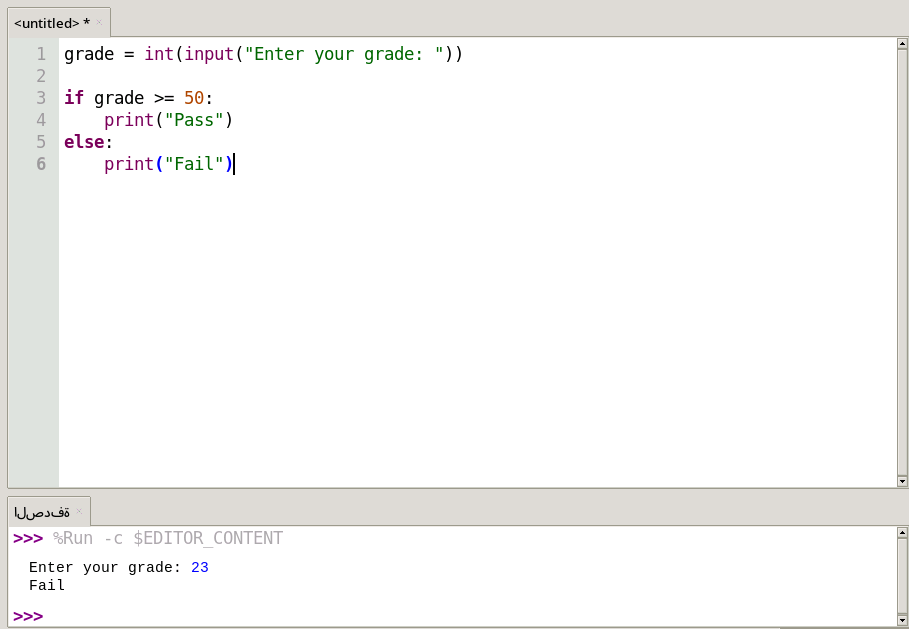

# 🎓 Grade Calculator

A simple Python project that checks whether a student has **passed or failed** based on the entered grade. The program asks the user to enter a grade, compares it with the passing score, and instantly displays the result.

## 📸 Screenshot

## ✨ Features

* 🎓 Enter a student's grade.
* ✅ Displays **Pass** if the grade is **50** or higher.
* ❌ Displays **Fail** if the grade is below **50**.
* 🖥️ Runs directly in the terminal.
* 🐍 Built entirely with Python.
* 🚀 Beginner-friendly and easy to understand.

## 📚 What You'll Learn

* 📥 Using the `input()` function.
* 🔄 Converting user input with `int()`.
* 🔀 Using `if` and `else` statements.
* ⚖️ Comparing values.
* 📤 Printing results with `print()`.

This project is a great starting point for beginners who want to practice conditional statements and build a solid foundation in Python programming.
